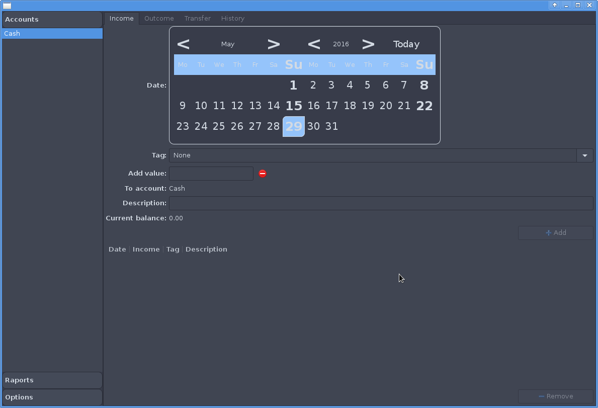
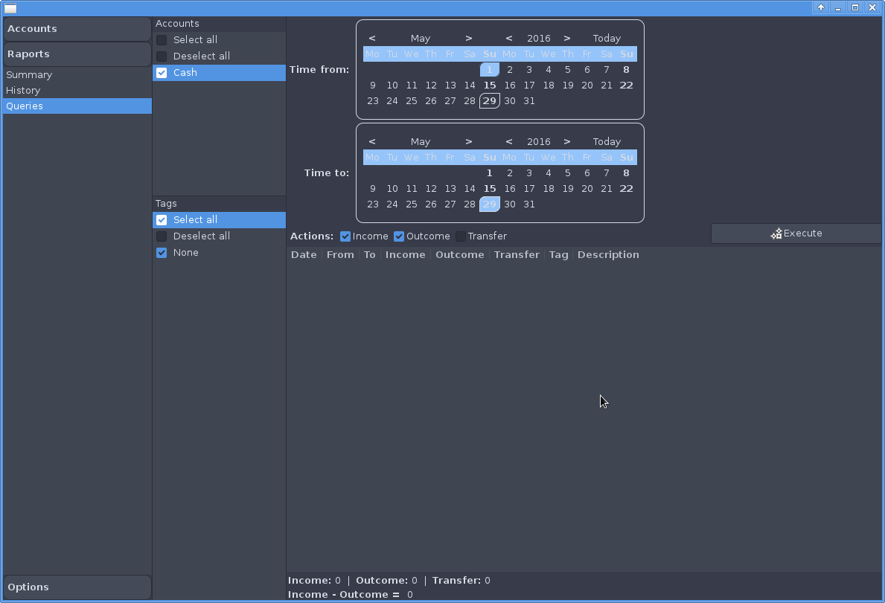
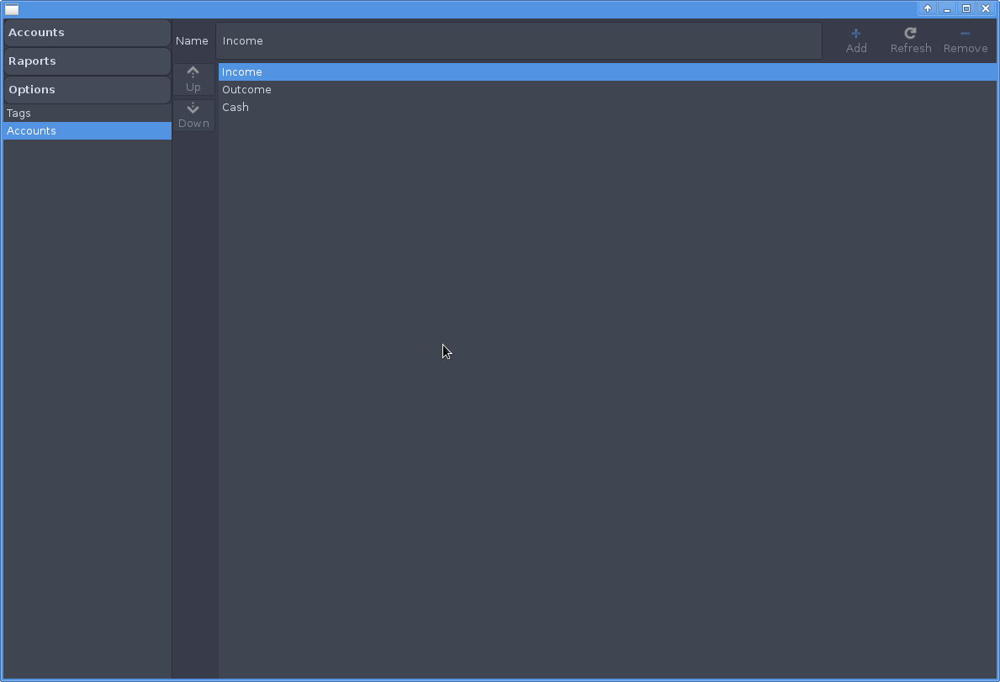

#About

Coin is a simple bank account manager.

#How to install

First, you need to install some dependencies (or check if they
are already installed):

  * gtk3 (tested on version 3.20)
  * sqlite3

Download binaries and untar it somewhere. That's all.

#Download

  * sources: [coin-sources-1.2.1.tar.xz][]
  * linux binaries: [coin-linux-x86_64-1.2.1.tar.xz][]
  * windows binaries: [coin-windows-x86_64-1.2.1.zip][]

[coin-sources-1.2.1.tar.xz]: https://github.com/piotrborek/gra3d/raw/main/files/coin-sources-1.2.1.tar.xz
[coin-linux-x86_64-1.2.1.tar.xz]: https://github.com/piotrborek/gra3d/raw/main/files/coin-linux-x86_64-1.2.1.tar.xz
[coin-windows-x86_64-1.2.1.zip]: https://github.com/piotrborek/gra3d/raw/main/files/coin-windows-x86_64-1.2.1.zip

#Screenshots

